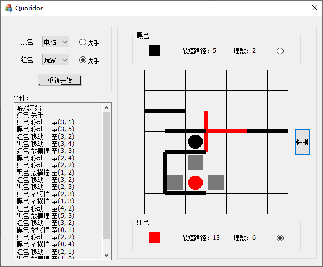
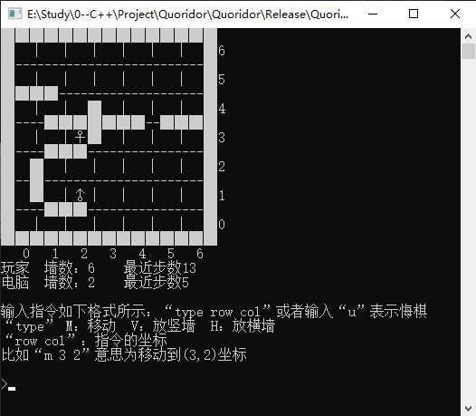

# 步步为营游戏AI

标签： C++ Quoridor

---

这是一个Quoridor游戏软件，并配置一个AI与玩家对战。

本项目包含'MFC_version'和'C++_version'两个branches。两个分支使用相同的程序结构。

其中，'MFC_version'是基于MFC框架制作的带可视化界面的游戏，操作简单。

'C++_version'是使用标准C++11编写的游戏，方便移植和理解算法。

目前，该项目仍在开发，新功能会直接添加到'C++_version'分支中，'MFC_version'则为稳定版本，所以两个分支会存在一定的程序差异。

 #### 软件截图
 

 #### 工程
 
Visual Studio 2019